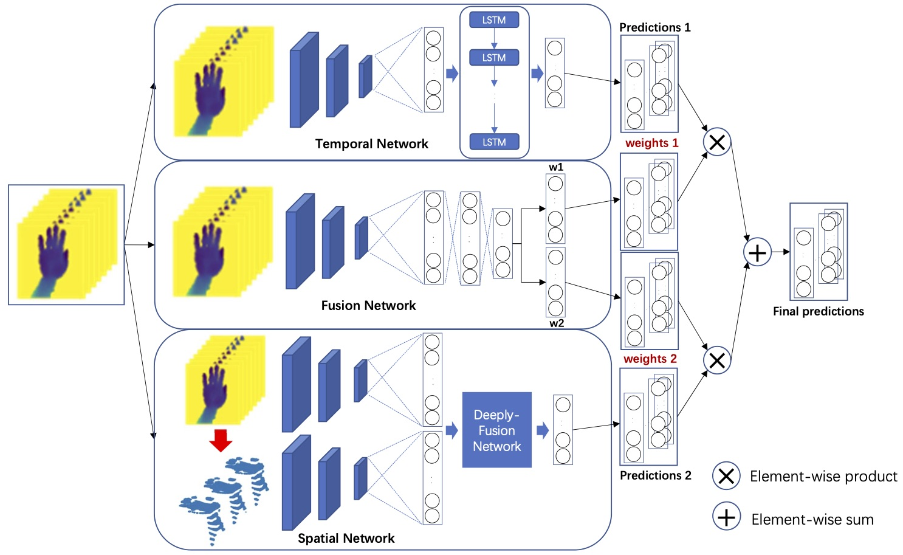
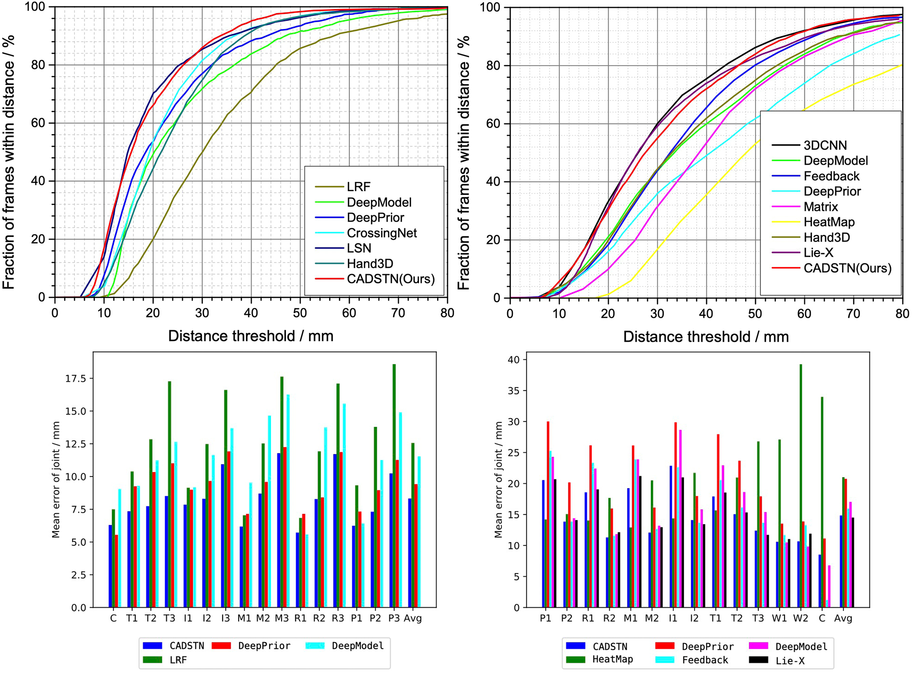
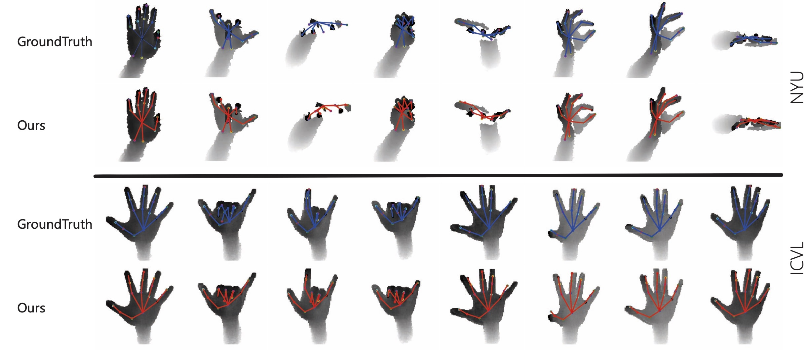

This is the caffe implementation for **Context-Aware Deep Spatio-Temporal Network for Hand Pose Estimation from Depth Images**.
## Introduction
We leverage an LSTM for capturing spatio-temporal context in the depth image sequences.



## Datasets

|Method | NYU | ICVL |
|---|---|---|
|HeatMap| 21.02 | - |
|LRF| - | 12.56 |
|DeepPrior| 19.73 | 9.42 |
|Feedback| 15.97 | - |
|DeepModel| 16.90 | 11.55 |
|Lie-X| 14.51 | - |
|CrossingNet| - | 10.22 |
|LSN| - | 8.20 |
|CADSN| 14.83 | 8.04 |

### Result


### Qualitative


## Citation
If you find the code is helpful for you, please kindly cite this paper in your publications:
```
@article{wu2018context,
  title={Context-Aware Deep Spatiotemporal Network for Hand Pose Estimation From Depth Images},
  author={Wu, Yiming and Ji, Wei and Li, Xi and Wang, Gang and Yin, Jianwei and Wu, Fei},
  journal={IEEE transactions on cybernetics},
  volume={50},
  number={2},
  pages={787--797},
  year={2018},
  publisher={IEEE}
}
``` 

